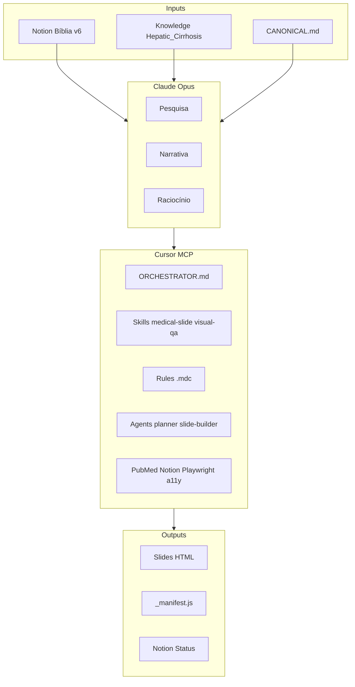

# Sistema Aulas Magnas — Pipeline Autônomo via Cursor

> **Repositório:** aulas-magnas — hub de todas as aulas. **Foco inicial:** Cirrose.
> **Roadmap:** Cirrose v6 completo → sistema validado → GRADE, Osteoporose, Meta-análise.
>
> **Pergunta:** Conseguimos criar aulas inteiras aqui? **Resposta:** Sim. Claude.ai só para conflitos novos.

### Princípios consolidados

| Princípio               | Regra                                                                                                 |
| ----------------------- | ----------------------------------------------------------------------------------------------------- |
| **Repositório**         | aulas-magnas (lucasmiachon-blip). Todas as aulas aqui.                                                |
| **Claude Opus**         | Composer + Opus 4.6. Hub de pesquisa e narrativa. Construímos juntos — colaborativo, não só autônomo. |
| **Cursor MCP**          | Cursor + MCPs. Código, execução, scripts, ferramentas externas. Mesma hierarquia que Claude Opus.     |
| **JS**                  | Low code primeiro. Máxima interatividade — não abrir mão. Custom quando necessário.                   |
| **Construir e ensinar** | Agentes, skills, rules produzem E explicam. Usuário roda com pouco conhecimento, aprende no processo. |
| **Ecossistema**         | Manter docs/ECOSYSTEM.md atualizado. Busca semanal de atualizações.                                   |

---

## 1. Ecossistema (Registro e Atualização)

### Ferramentas do Lucas

| Ferramenta                   | Uso no pipeline                        | Atualização        |
| ---------------------------- | -------------------------------------- | ------------------ |
| **Claude Opus** (Composer)   | Hub pesquisa, narrativa, raciocínio    | Cursor auto-update |
| **Cursor MCP**               | Código, execução, MCPs, scripts        | Cursor auto-update |
| **Claude Ultra** (claude.ai) | Conflitos, decisões narrativas         | —                  |
| **Perplexity Ultra**         | Pesquisa em tempo real                 | MCP ou manual      |
| **Gemini Ultra**             | Alternativa pesquisa/raciocínio        | —                  |
| **ChatGPT Pro Max**          | Alternativa tarefas específicas        | —                  |
| **Scite**                    | Supporting/contradicting               | MCP streamableHttp |
| **Consensus**                | Meta-análises, síntese                 | Manual             |
| **Elicit**                   | Extração de papers                     | Manual             |
| **Notion**                   | Specs, Bíblia, References              | MCP                |
| **Canva Pro**                | Assets visuais, diagramas              | —                  |
| **Excalidraw**               | Diagramas, storyboards (ex: D'Amico)   | Notion embed       |
| **Obsidian**                 | (sem uso) — graph conhecimento futuro  | —                  |
| **Microsoft Copilot Pro**    | Alternativa pesquisa, Edge, Office 365 | —                  |
| **Zotero**                   | Referências, biblioteca, citações      | MCP                |

### GitHub (lucasmiachon-blip)

| Repo         | Path local                   | Conteúdo                                    |
| ------------ | ---------------------------- | ------------------------------------------- |
| aulas_core   | C:\Dev\Projetos\Aulas_core   | Origem migração                             |
| aulas_core   | C:\Dev\Projetos\Aulas2       | GRADE, Osteoporose                          |
| aulas-magnas | C:\Dev\Projetos\aulas-magnas | **Hub atual** — Cirrose, GRADE, Osteoporose |

**Onde registrar:** `docs/ECOSYSTEM.md` — adicionar/remover conforme ecossistema muda.

### Como Atualizar o Ecossistema

1. **Nova ferramenta:** Adicionar em `docs/ECOSYSTEM.md` com uso + se tem MCP
2. **MCP novo:** Configurar em `.cursor/mcp.json`, testar `claude mcp list`
3. **Skill novo:** Criar em `.cursor/skills/[nome]/SKILL.md` (ver sec 4)
4. **Agent novo:** Adicionar em `agents/` e referenciar em AGENTS.md
5. **Busca semanal:** Rodar prompt em `docs/prompts/weekly-updates.md` — atualizar ECOSYSTEM.md se houver mudanças

---

## 2. Melhorias Contínuas (Autoaprimoramento)

### Loop de Self-Improvement (CLAUDE.md)

- Após **qualquer correção** do usuário → atualizar `tasks/lessons.md`
- Escrever regras que previnam o mesmo erro
- Revisar lessons no início de sessão

### Busca Semanal de Atualizações

| O quê                 | Onde verificar                      | Frequência |
| --------------------- | ----------------------------------- | ---------- |
| MCPs                  | npm/uvx changelogs, GitHub releases | Semanal    |
| Cursor                | Changelog Cursor                    | Semanal    |
| Skills Cursor         | `.cursor/skills/` vs docs oficiais  | Mensal     |
| Reveal.js, GSAP, Vite | npm outdated                        | Mensal     |
| PubMed/CrossRef APIs  | Docs NCBI                           | Trimestral |

**Ação:** Subagent `generalPurpose` ou `explore` com prompt:

```
Buscar atualizações dos últimos 7 dias para: MCP servers (pubmed, notion, playwright, a11y), Cursor, Reveal.js, Vite, GSAP. Listar versões atuais vs latest. Flag breaking changes. Atualizar docs/ECOSYSTEM.md se houver mudanças.
```

Salvar em `docs/prompts/weekly-updates.md` para reutilizar.

### Documentar Melhorias

- `CHANGELOG.md` — mudanças de código
- `tasks/lessons.md` — padrões aprendidos
- `docs/ECOSYSTEM.md` — ferramentas + versões

---

## 3. Capacidades Atuais (Inventário)

### MCPs funcionais

| MCP                                     | Uso no pipeline                        |
| --------------------------------------- | -------------------------------------- |
| **pubmed** / pubmed-simple              | Verificar PMIDs, buscar evidência      |
| **crossref**                            | Validar DOIs                           |
| **notion**                              | Specs, Bíblia Narrativa, References DB |
| **playwright**                          | Screenshots, QA visual                 |
| **a11y**                                | Contraste, acessibilidade              |
| **eslint**                              | Lint slides                            |
| **memory**                              | Contexto entre sessões (após fix)      |
| **biomcp**                              | Dados biológicos                       |
| **zotero**                              | Referências                            |
| **perplexity** / google-scholar / arxiv | Pesquisa ampliada                      |
| **scite**                               | Citações, supporting/contradicting     |

### MCPs com fix (MCP-FIXES.md)

- **filesystem**: `${PROJECT_DIR}` não resolve → path absoluto
- **memory**: `${PROJECT_DIR}` no env → path absoluto
- **semantic-scholar**: ignorar (não bloqueia)

### Skills

- **medical-slide**: Notion → spec → HTML assertion-evidence
- **visual-qa**: Playwright + a11y → screenshots + report

### Subagents (mcp_task)

- **explore**: Explorar codebase
- **generalPurpose**: Pesquisa, tarefas multi-step
- **shell**: Git, comandos
- **qa-engineer**: Lint, a11y, screenshots
- **slide-builder**: Criar slides HTML
- **reference-manager**: Validar PMIDs/DOIs
- **medical-researcher**: Pesquisa clínica

### Regras (.cursor/rules)

- core-constraints, medical-data, slide-editing, plan-mode, design-principles, cirrose-design, notion-mcp, css-errors
- **Construir e ensinar:** Regras orientam decisões e explicam o porquê (ex: por que var(), por que assertion-evidence)

---

## 4. Melhores Práticas

### Skills (.cursor/skills/)

- **Propósito único:** 1 skill = 1 workflow (ex: medical-slide, visual-qa)
- **Triggers explícitos:** "When to use" com cenários concretos
- **Construir e ensinar:** Explicar decisões (por que esse data-animate, por que custom aqui)
- **Estrutura:** `SKILL.md` + opcional `reference.md`, `examples.md`
- **Scope:** Project (`.cursor/skills/`) para compartilhar no repo
- **Atualizar:** Quando workflow mudar ou novo anti-pattern surgir

### Subagents (mcp_task)

- **One tack:** 1 subagent = 1 tarefa focada
- **Paralelo:** Lançar 2–4 subagents quando tarefas independentes
- **Explore:** Codebase, arquivos, padrões
- **generalPurpose:** Pesquisa, multi-step
- **shell:** Git, comandos
- **Não:** Delegar tarefa que depende de contexto da conversa principal

### Agents (agents/ + AGENTS.md)

- **AGENTS.md** = fonte única de regras globais (stack, regras invioláveis, estrutura)
- **agents/.md** = specs por agente (identidade, faz/não faz, inputs/outputs)
- **Construir e ensinar:** Agentes explicam o que fizeram — o usuário aprende no processo
- **Manter sincronizado:** Se regra muda em AGENTS.md, propagar para agents específicos
- **Convenção:** `NN-nome.md` (01-planner, 07-slide-builder)

### MCP (.cursor/mcp.json)

- **Paths absolutos** no Windows: `C:\\Dev\\Projetos\\aulas-magnas` (evitar `${PROJECT_DIR}`)
- **Env vars:** Usar `${VAR}` para secrets (NCBI_API_KEY, NOTION_TOKEN)
- **Antes de chamar:** Ler schema em `mcps/[server]/tools/*.json`
- **Testar:** `claude mcp list` após mudanças

### Excalidraw

- **Uso:** Diagramas D'Amico, pathways, storyboards visuais
- **Integração:** Notion embed (HANDOFF-v6-SLIM: Excalidraw D'Amico `b4f04df2fc7345c0b8`)
- **Export:** SVG/PNG para slides ou referência em specs

### JS — Low Code + Máxima Interatividade + Ensino

- **Máxima interatividade:** Não abrir mão. O sistema produz o melhor possível.
- **Low code primeiro:** Preferir declarativo quando entrega. Custom quando necessário.
- **Agentes, skills, rules = construir E ensinar:** O usuário roda com pouco conhecimento. O sistema constrói e explica o que fez — cada decisão JS, cada animação, cada interação.
- **Registro:** Custom anims em `slide-registry.js`. Documentar o porquê.
- **Fallback:** Conteúdo legível sem JS.

---

## 5. O Que os 7 Docs Novos Resolvem

| Doc                              | Função                               | Resolve                              |
| -------------------------------- | ------------------------------------ | ------------------------------------ |
| **ORCHESTRATOR.md**              | Playbook único para construir slides | Protocolo passo a passo, specs P1–P5 |
| **specs-v6-ready.md**            | Specs completas blocos 3–15          | 7 campos obrigatórios por slide      |
| **v3-to-v6-mapping.md**          | Mapeamento v3→v6                     | O que refatorar, criar, reutilizar   |
| **HANDOFF-v6-SLIM.md**           | Antônio + sequência + PMIDs          | Fonte da verdade v6                  |
| **Hepatic_Cirrhosis_Staging.md** | Brain clínico                        | D'Amico, Baveno, PREDESCI            |
| **CANONICAL.md**                 | Dados canônicos                      | Mata conflitos C1/C2                 |
| **MCP-FIXES.md**                 | Fixes MCP                            | filesystem, memory                   |

---

## 6. Arquitetura do Sistema



---

## 7. Fluxo Autônomo (sem Claude.ai)

| Etapa           | Onde        | Ferramentas                                                          |
| --------------- | ----------- | -------------------------------------------------------------------- |
| Pesquisa        | Claude Opus | PubMed, CrossRef, Zotero, Perplexity, Scite — **construímos juntos** |
| Narrativa       | Claude Opus | Notion MCP, narrative.md, Excalidraw — **construímos juntos**        |
| Spec            | Cursor MCP  | specs-v6-ready, ORCHESTRATOR                                         |
| Build slide     | Cursor MCP  | medical-slide skill, Slide Builder agent — **construir e explicar**  |
| Verificação     | Cursor MCP  | visual-qa skill, Playwright, a11y                                    |
| Assets visuais  | Canva Pro   | Diagramas, ícones (manual)                                           |
| Conflitos       | Cursor MCP  | CANONICAL.md (prescrito)                                             |
| Conflitos novos | Claude.ai   | Só quando CANONICAL não cobre                                        |

---

## 8. Plano de Bootstrap (incorporar 7 docs)

### Fase 0 — Copiar docs

1. Copiar `ORCHESTRATOR.md` → `aulas/cirrose/ORCHESTRATOR.md`
2. Copiar `specs-v6-ready.md` → `aulas/cirrose/specs-v6-ready.md`
3. Copiar `v3-to-v6-mapping.md` → `aulas/cirrose/v3-to-v6-mapping.md`
4. Copiar `HANDOFF-v6-SLIM.md` → `aulas/cirrose/HANDOFF-v6-SLIM.md`
5. Criar `aulas/cirrose/knowledge/` e copiar `Hepatic_Cirrhosis_Staging.md`
6. Copiar `CANONICAL.md` → `aulas/cirrose/CANONICAL.md`
7. Arquivar `MCP-FIXES.md` em `docs/` (referência)
8. Criar `docs/ECOSYSTEM.md` — registro de ferramentas (tabela sec 1)

### Fase 1 — Fixes

1. Aplicar MCP-FIXES: `.cursor/mcp.json` (filesystem, memory paths)
2. Criar `.memory/` dir
3. Corrigir `evidence-db.md`: Baveno VII PMID 35431106 → 35120736
4. Corrigir `CLAUDE.md`: idade 54→55, álcool 40g→60g
5. Corrigir `narrative.md`: álcool 40g→60g

### Fase 2 — Merge branch

1. Merge `refactor/floating-panel` → `main`

### Fase 3 — Executar P1

1. Ler ORCHESTRATOR + CANONICAL + Hepatic_Cirrhosis_Staging
2. Criar `v6-03-damico.html` conforme spec
3. Atualizar `_manifest.js`
4. Lint + screenshot + commit

---

## 9. Resposta: Conseguimos?

**Sim.** Com:

- MCPs (PubMed, Notion, Playwright, a11y, etc.)
- Skills (medical-slide, visual-qa)
- Subagents (explore, slide-builder, qa-engineer)
- Docs (ORCHESTRATOR, specs, CANONICAL, Knowledge)
- Claude Opus + Cursor MCP (mesma hierarquia)

O pipeline roda **inteiro aqui**. Claude.ai só para:

- Conflitos novos não previstos no CANONICAL
- Decisões humanas (ex.: escolher entre 2 designs)
- Revisão final de narrativa antes de congresso

---

## 10. Todos (checklist)

- Fase 0: Copiar 7 docs + criar docs/ECOSYSTEM.md
- Fase 1: MCP fixes + correções CANONICAL
- Fase 2: Merge refactor/floating-panel
- Fase 3: P1 — v6-03-damico.html
- P2–P5: Sequência conforme roadmap
- Configurar prompt semanal: busca atualizações MCP/Cursor/npm
- Manter docs/ECOSYSTEM.md e tasks/lessons.md atualizados

**Roadmap:** Cirrose v6 completo → sistema validado → expandir para GRADE, Osteoporose, Meta-análise.
