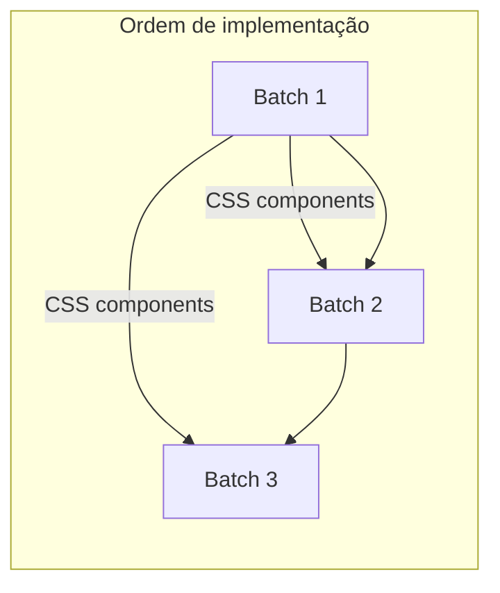

# Plano Unificado — Cirrose: 3 Batches (20 slides)

> **FONTE ÚNICA DE VERDADE:** CIRROSE — ORDEM DEFINITIVA v3 (24/fev/2026)
>
> **Fontes auxiliares:** 3 MD em Downloads (batch1, batch2, batch3)
>
> **Projeto:** aulas-magnas · Plan C (light, GSAP, 1280×720)

---

## 1. Estado atual do repo

| Item | Valor |
|------|-------|
| Arquivo alvo | `aulas/cirrose/index.stage-c.html` |
| Sections existentes | 4 (TITLE, A1-01, A1-02, HOOK) |
| Design system | `shared/css/base.css` — tokens OKLCH, `.stage-c` |
| Engine | `shared/js/engine.js` — countUp, stagger, fadeUp, drawPath, highlight, registerCustom |
| cirrose.css | slide-inner, section-tag, slide-headline, source-tag, card-metric, data-grid, hook-question |

---

## 2. Ordem narrativa final (20 slides) — ORDEM DEFINITIVA v3

```
0  TITLE      ← já no HTML
1  A1-01      ← já no HTML (espectro Villanueva)
2  A1-02      ← já no HTML (Baveno VII)
3  HOOK       ← já no HTML (advance organizer 5+3 + caso) — posição 4, NÃO mover
4  A1-03      ← Batch 2 · MELD semáforo
5  A1-04      ← Batch 2 · PREDICT precipitantes
6  A1-05      ← Batch 2 · Etiologias
7  CP1        ← Batch 2 · Checkpoint (LSM 21, PLQ 118k)
8  A2-01      ← Batch 3 · PREDESCI carvedilol
9  A2-02      ← Batch 1 · Early TIPS
10 A2-03      ← Batch 3 · Albumina
11 A2-04      ← Batch 1 · PBE
12 A2-05      ← Batch 3 · HRS-AKI
13 A2-06      ← Batch 1 · Encefalopatia
14 CP2        ← Batch 1 · Checkpoint (Cr 2,8, Na 126)
15 A3-01      ← Batch 1 · Recompensação
16 A3-02      ← Batch 1 · Etiologias SVR/álcool/MASLD
17 A3-03      ← Batch 1 · Vigilância CHC
18 CP3        ← Batch 3 · Checkpoint (LSM 32→18)
19 CLOSE      ← Batch 3 · Fechamento
```

**Ação crítica:** Inserir A1-03, A1-04, A1-05, CP1 **após o HOOK** (section 4). HOOK permanece na posição 4 — preserva HTML existente (ORDEM DEFINITIVA v3).

---

## 3. Dependências entre batches



- **Batch 1** traz o CSS (evidence-panel, bar-chart, timeline, etc.). Batch 2 e 3 dependem desses componentes.
- **Batch 2** insere A1-03, A1-04, A1-05, CP1 **após o HOOK**. HOOK não é movido (ORDEM DEFINITIVA v3).
- **Batch 3** insere A2-01, A2-03, A2-05, CP3, CLOSE — intercalados com slides do Batch 1.

---

## 4. Resumo por batch

### Batch 1 — Ato 2 + Ato 3 (7 slides + CSS)

| Index | ID | Headline |
|-------|-----|----------|
| 9 | A2-02 | Early TIPS salva vidas no sangramento varicoso |
| 11 | A2-04 | PBE: PMN ≥250 = tratar. Cada hora de atraso custa vidas |
| 13 | A2-06 | Encefalopatia: lactulose + rifaximina + nutrição — NÃO restringir proteína |
| 14 | CP2 | Cr 2,8 + Na 126 + ascite tensa. HRS-AKI? O que você faz? |
| 15 | A3-01 | Recompensação é real — e Baveno VII a definiu |
| 16 | A3-02 | SVR cura o vírus mas não a hipertensão portal — CSPH persiste em 53% |
| 17 | A3-03 | Vigilância a cada 6 meses — nunca dar alta, mesmo após "cura" |

**CSS (cirrose.css):** evidence-panel, panel-safe/warning/danger, hero-metric, bar-chart, bar-row, bar-fill, timeline-h, cols-2, cols-3, myth-text, truth-text, scenario-bar, meld-badge, reveal-step, paradigm-before/after, risk-curve-container, icon-safe/warning/danger, no-js fallbacks.

**registerCustom:** A2-06 myth-buster (index 13), CP2 progressive reveal (index 14), A3-03 never-zero pulse (index 17).

---

### Batch 2 — Ato 1 restante (4 slides) — inserir APÓS HOOK

| Index | ID | Headline |
|-------|-----|----------|
| 4 | A1-03 | MELD-Na é o GPS do cirrótico — e tem um semáforo |
| 5 | A1-04 | Infecção precipita 1 em 3 descompensações — e é a mais prevenível |
| 6 | A1-05 | "Cirrose" não é uma doença — são 10 doenças com final comum |
| 7 | CP1 | LSM 21 kPa, plaquetas 118k. Como você estadia? |

**A1-06:** NÃO EXISTE neste ciclo (ORDEM DEFINITIVA v3).

**Ação:** Inserir **após** s-hook (section 4). HOOK permanece na posição 4 — NÃO mover.

**registerCustom:** CP1 progressive reveal (index 7).

---

### Batch 3 — Ato 2 restante + Close (5 slides)

| Index | ID | Headline |
|-------|-----|----------|
| 8 | A2-01 | Carvedilol previne a primeira descompensação — comece antes da ascite |
| 10 | A2-03 | Albumina: 3 indicações certas, 1 armadilha — repor, não normalizar |
| 12 | A2-05 | HRS-AKI: 3 perguntas antes da terlipressina — a 3ª decisão |
| 18 | CP3 | SVR + abstinência, LSM 32→18. Pode sair da vigilância? Da fila? |
| 19 | CLOSE | 5 números classificaram. 3 decisões salvaram. Cirrose não é sentença. |

**registerCustom:** CP3 progressive reveal (index 18).

---

## 5. Ordem de implementação

### Fase 1 — CSS (Batch 1)

Adicionar blocos CSS do Batch 1 em `cirrose.css` (seção §6 do batch1-cursor-cirrose-ato2-ato3.md). Todos os batches usam esses componentes.

### Fase 2 — Inserção em ordem narrativa (ORDEM DEFINITIVA v3)

Inserir as 16 novas sections **na ordem correta**, em uma única passada:

1. Manter TITLE, A1-01, A1-02, **HOOK** (4 sections já no HTML — ordem correta)
2. Após `</section>` do **HOOK**, inserir: **A1-03, A1-04, A1-05, CP1** (Batch 2)
3. Após `</section>` do CP1, inserir na ordem: **A2-01** (B3), **A2-02** (B1), **A2-03** (B3), **A2-04** (B1), **A2-05** (B3), **A2-06** (B1), **CP2** (B1), **A3-01** (B1), **A3-02** (B1), **A3-03** (B1), **CP3** (B3), **CLOSE** (B3)

**HOOK permanece na posição 4** — NÃO mover (ORDEM DEFINITIVA v3).

---

## 6. Procedimento de inserção (recomendado) — ORDEM DEFINITIVA v3

1. Manter TITLE, A1-01, A1-02, **HOOK** (4 sections — ordem já correta).
2. Após HOOK, inserir: **A1-03, A1-04, A1-05, CP1** (Batch 2).
3. Após CP1, inserir na ordem: **A2-01**, **A2-02**, **A2-03**, **A2-04**, **A2-05**, **A2-06**, **CP2**, **A3-01**, **A3-02**, **A3-03**, **CP3**, **CLOSE**.

Ou: construir o HTML completo em ordem e substituir o bloco de sections.

---

## 7. registerCustom — índices finais (HOOK=3, A1-03=4…)

| Index | Slide | Animação |
|-------|-------|----------|
| 3 | HOOK | Stagger framework + case (já implementado) |
| 7 | CP1 | Progressive reveal + MELD badge glow |
| 13 | A2-06 | Myth-buster (strikethrough → truth) |
| 14 | CP2 | Progressive reveal + MELD badge pulse |
| 17 | A3-03 | Never-zero label pulse |
| 18 | CP3 | Progressive reveal |

---

## 8. Ajustes de compatibilidade

| Item | Ação |
|------|------|
| `data-background-color="var(--bg-surface)"` | Reveal pode não resolver var() em data-attr. Omitir ou usar classe. Plan C já tem bg via body.stage-c. |
| `color: white` (A1-03 MELD ≥25) | Substituir por `color: var(--text-on-dark)` (regra var() obrigatória). |
| `fill-cmp2` | Batch 2 usa; Batch 1 define `fill-cmp1`, `fill-cmp2`. Adicionar se faltar. |

---

## 9. Validação

```bash
grep -c '<section' aulas/cirrose/index.stage-c.html
# Esperado: 20

npm run lint:slides
npm run build
npm run preview
```

---

## 10. Arquivos a modificar

| Arquivo | Ação |
|---------|------|
| `aulas/cirrose/cirrose.css` | +~250 linhas (componentes Batch 1) |
| `aulas/cirrose/index.stage-c.html` | +16 sections, reordenar HOOK, +registerCustom |

---

*Plano gerado em 24/02/2026. Atualizado com ORDEM DEFINITIVA v3 (HOOK posição 4, não mover).*
